**I'm Jack. I go by xtsy.** I build tools.

Seventeen, in Seattle, shipping things people can actually open since 2021.

<a href="https://xtsy.is-a.dev">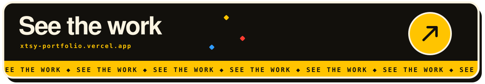</a>

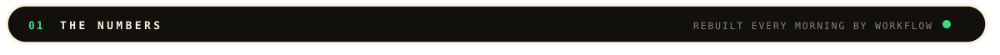

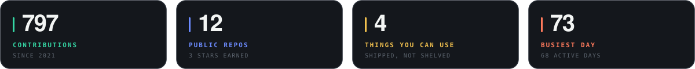

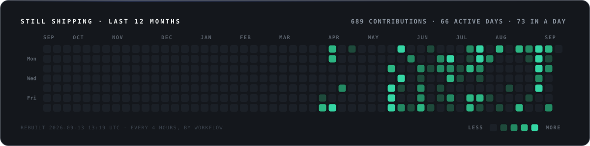

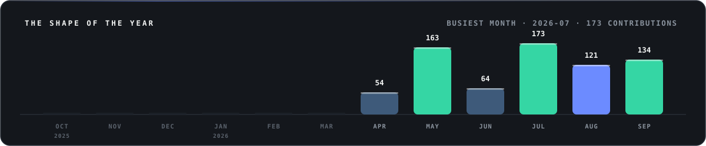

<a href="https://trace-rosy-one.vercel.app">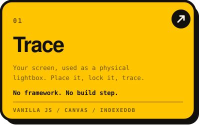</a>
<a href="https://github.com/Jackmod/iphonelocationspoof">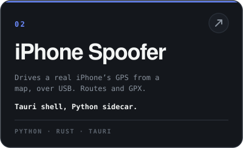</a>
<a href="https://createownruneverything.vercel.app">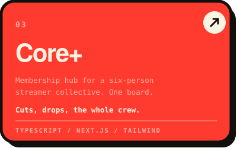</a>
<a href="https://xtsy.is-a.dev">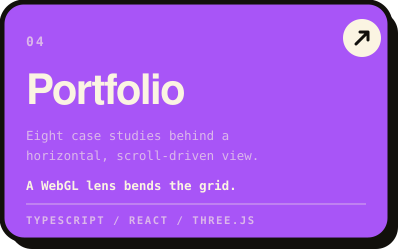</a>
<a href="https://github.com/Jackmod/CRYPTONIX-DISCONTINUED">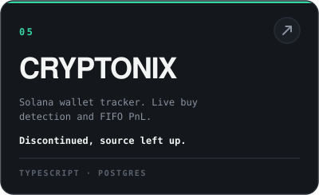</a>
<a href="https://github.com/Jackmod/DISPATCH">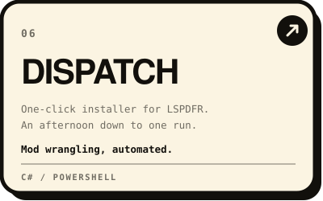</a>

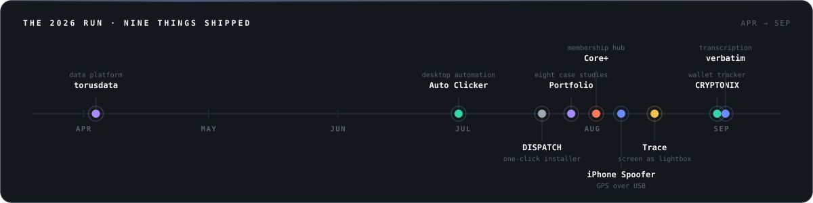

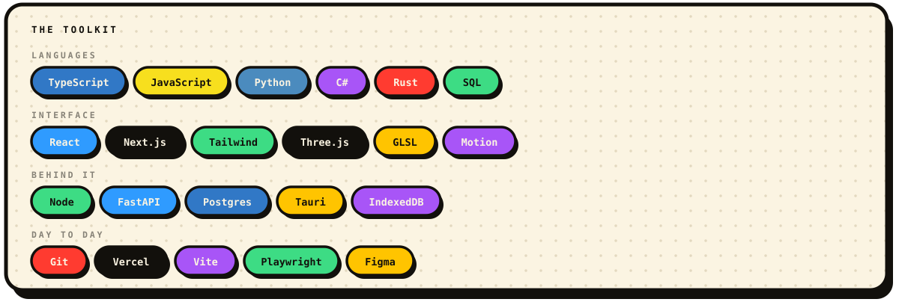

 

 
<a href="https://xtsy.is-a.dev"><b>xtsy.is-a.dev</b></a> &nbsp;·&nbsp; <a href="https://github.com/Jackmod"><b>GitHub</b></a>
  
The metrics, heatmap and year chart redraw themselves each morning — <a href="https://github.com/Jackmod/Jackmod/blob/master/.github/workflows/refresh.yml">a workflow</a> rebuilds them from the API.
  
Open to work &nbsp;·&nbsp; Seattle, WA

