I'm Jack. I go by **xtsy**, and I build things where the interface *is* the product.

A tracing tool that turns your screen into a lightbox. A GPS simulator that lies to a real iPhone over USB. A wallet tracker that catches a buy the second it lands. I'd rather ship one tool that does a single thing exactly right than five that almost work.

Seventeen, based in Seattle, pushing commits since 2021.

 

## Selected work

| | | |
|:--|:--|:--|
| **[Portfolio](https://xtsy-portfolio.vercel.app)** | Eight case studies and a horizontal case view, with a WebGL lens that bends the thumbnails by scroll velocity. | `TypeScript` `React` `Three.js` `GSAP` |
| **[Trace](https://trace-rosy-one.vercel.app)** | Your screen as a physical lightbox. Drop a photo, place it where the paper sits, lock it, draw. No framework, no build step, and nothing ever leaves the device. | `Vanilla JS` `Canvas 2D` `IndexedDB` |
| **[Core+](https://createownruneverything.vercel.app)** | Membership hub for a six-person streamer collective. One live board instead of six scattered channels. | `TypeScript` `Next.js` `Tailwind` |
| **[iPhone Location Spoofer](https://github.com/Jackmod/iphonelocationspoof)** | Drives a real iPhone's GPS from a map over USB. Drop a pin, drive a route at a real speed, or queue a world tour and export it as GPX. Tauri shell, Python sidecar. | `Python` `Rust` `Tauri` `Leaflet` |
| **[CRYPTONIX](https://github.com/Jackmod/CRYPTONIX-DISCONTINUED)** | Solana wallet tracking engine — live buy detection, Axiom link generation, FIFO PnL. Discontinued, source left up. | `TypeScript` `Postgres` |
| **[DISPATCH](https://github.com/Jackmod/DISPATCH)** | One-click installer for LSPDFR. Takes a mod setup that normally eats an afternoon down to a single run. | `C#` `PowerShell` |
| **[AntiGravity Auto Prompt Clicker](https://github.com/Jackmod/AntiGravity-Auto-Prompt-Clicker)** | Desktop automation that clicks through prompts so I don't have to. | `Python` |

 

## What I write

**Daily** &nbsp;·&nbsp; TypeScript &nbsp;·&nbsp; JavaScript &nbsp;·&nbsp; Python &nbsp;·&nbsp; HTML/CSS

**Comfortable** &nbsp;·&nbsp; C# &nbsp;·&nbsp; SQL &nbsp;·&nbsp; Bash &nbsp;·&nbsp; PowerShell

**Poking at** &nbsp;·&nbsp; Rust &nbsp;·&nbsp; GLSL

 

## What I build it with

<table>
<tr>
<td valign="top">

**Front end**

React · Next.js
Tailwind · shadcn/ui
Three.js · WebGL / GLSL
GSAP · Motion
Vite · Leaflet

</td>
<td valign="top">

**Back end & data**

Node · FastAPI
Postgres · IndexedDB
Solana RPC
Tauri (desktop)
REST · JSON APIs

</td>
<td valign="top">

**Tooling**

Git · Vercel
Playwright
PyInstaller
Vite · PostCSS
ESLint

</td>
</tr>
</table>

 

## How I work

- **The detail is the job.** A 3% scale pop on a scrolling thumbnail is a bug, and I'll spend the afternoon proving where it came from.
- **Measure it, don't eyeball it.** If I say it's fixed, I have numbers out of a real browser to back it up.
- **Read the source.** Faster than guessing, every time.
- **Ship, then look at it on a real device.** Localhost lies.

 

---

 

**[Portfolio](https://xtsy-portfolio.vercel.app)** &nbsp;·&nbsp; **[GitHub](https://github.com/Jackmod)**

Open to work · Seattle, WA

